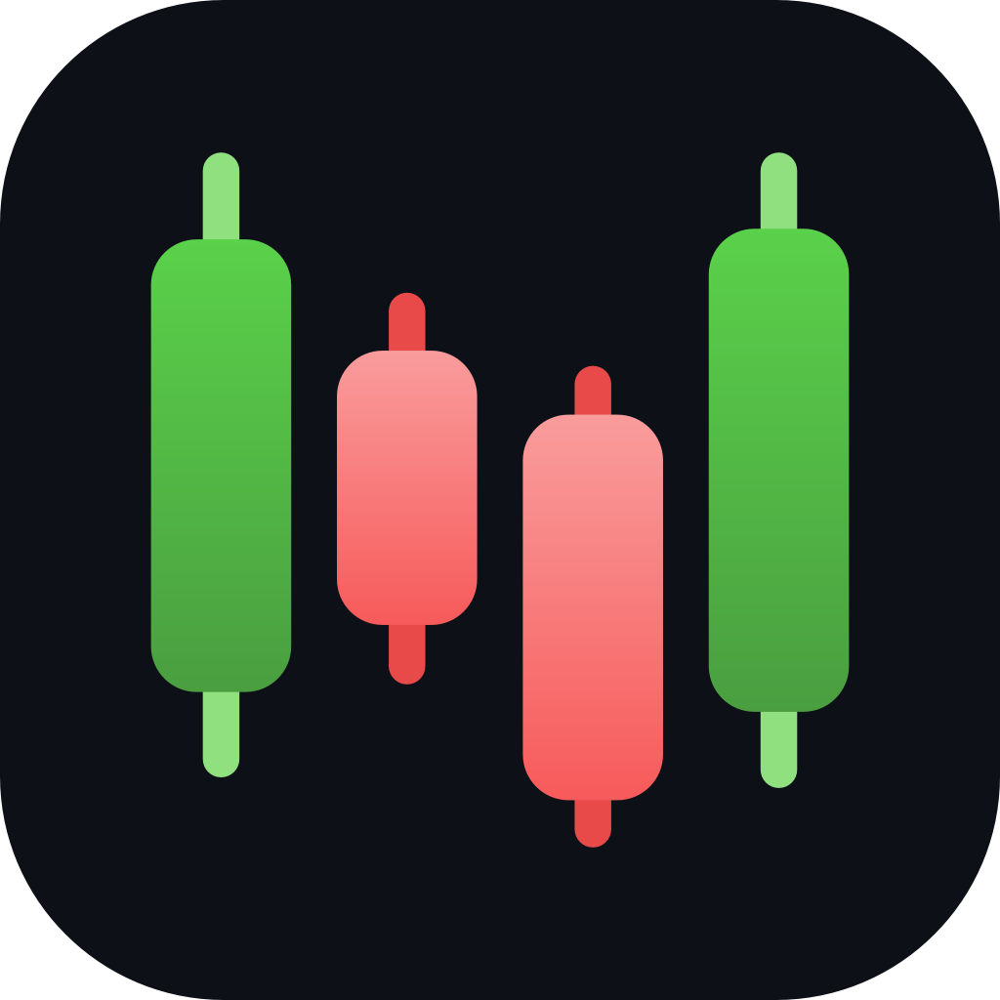
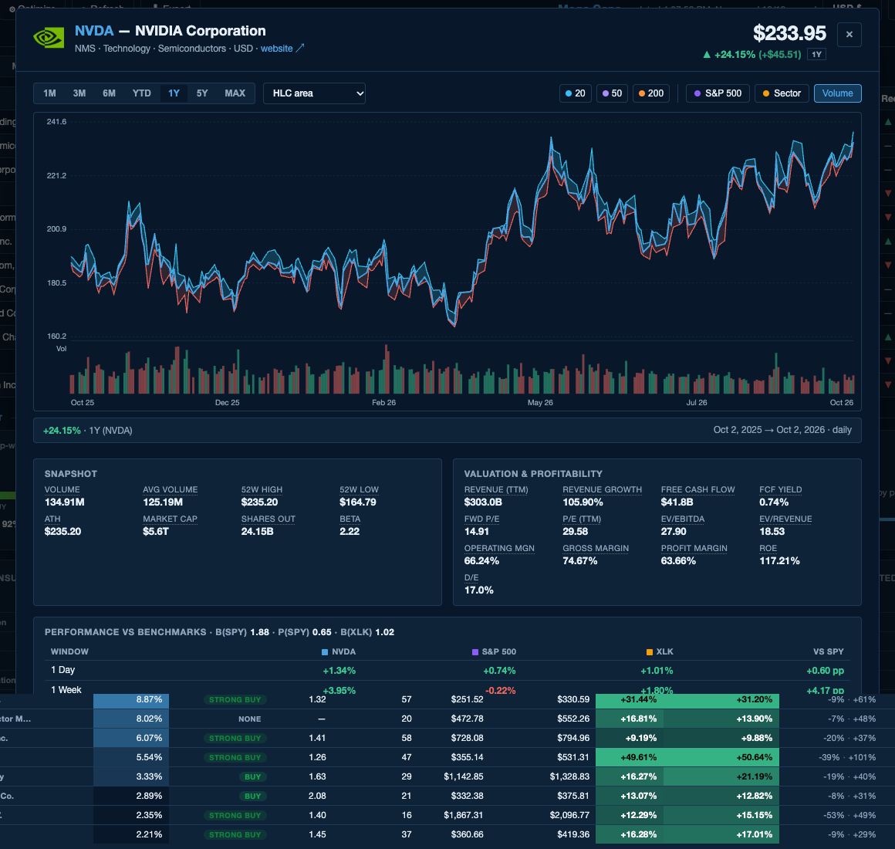

<h1>

Convexity<br>
<a href="https://github.com/ithakis/Convexity/actions/workflows/ci.yml"></a>
<a href="https://github.com/ithakis/Convexity/releases/latest"></a>
<a href="LICENSE"></a>
</h1>

**Convexity** — a portfolio optimization app built for long-term horizon investing. Runs locally: no cloud accounts, no data leaving your machine.

Built on top of [yfinance](https://github.com/ranaroussi/yfinance) and a tiny stdlib HTTP server. Open it in any browser, paste your tickers, and get a live heat-mapped table in seconds.


## A tour

**Stock detail.** Click any row for its price history from one month to the full record, with moving averages, volume and S&P 500 or sector overlays, the snapshot and valuation numbers behind the row, and its returns against the S&P 500 and its sector ETF over every window.



**Portfolio optimization.** Black-Litterman expected returns (market-cap equilibrium blended with analyst price-target views) and a mean-CVaR efficient frontier solved by a custom 8-core interior-point solver. Slide along the frontier, see the tail risk, weights and bootstrap uncertainty band, and apply the result as a weight preset.


**Portfolio analytics.** Performance against the S&P 500 (plus Nasdaq and a sector-mix overlay), moving averages, drawdown, and a risk & return card with Sharpe and Sortino (over the T-bill rate in USD), Calmar, beta, tracking error and information ratio against any benchmark.


**Analyst sentiment.** Weighted consensus rating, rating distribution, price-target upside (mean and median) and the full range of analyst targets for every holding.


**News & sentiment.** Two independent reads of every holding's headlines: the *News read* (an LLM scoring each headline across financials, outlook, competition, regulation and street view) and the *Market read* (a statistical model of how prices have historically reacted to news like this). Plus movers, what to watch, a market-risk line and a per-headline timeline.


---

## Features

The columns of the **Default** view. $`P_t`$ is the latest close, adjusted for
splits and dividends, so every return below is a total return. Cells are
heat-mapped against the other rows on screen.

| Column | Definition | Read it as |
|---|---|---|
| **Market Cap** | $`P_t \cdot N_{\mathrm{shares}}`$ | size, in the display currency |
| **P/E** | $`P_t / \mathrm{EPS}_{\mathrm{TTM}}`$ | price per unit of trailing earnings; blank for loss-makers |
| **% YTD** | $`P_t / P_{\mathrm{Dec\ 31}} - 1`$ | return since last year's final close |
| **% 1Y** | $`P_t / P_{t - 365\mathrm{d}} - 1`$ | return over one calendar year |
| **Chart 1Y** | $`\left( P_{t-251}, \dots, P_t \right)`$ | the last 252 closes, coloured by the sign of % 1Y |
| **Δ Highs** | $`P_t / \max_{s \in 2\mathrm{y}} P_s - 1`$ | how far below the 2-year high; $`0`$ means at the high |
| **RS Rank 1M** | $`\dfrac{P_m - \min_{12\mathrm{m}} P}{\max_{12\mathrm{m}} P - \min_{12\mathrm{m}} P}`$ | one bar per month $`m`$: where that month's close sat in its trailing-year range, $`0`$ at the low, $`1`$ at the high |
| **20 / 50 / 200 MA** | $`P_t \gtrless \mathrm{SMA}_n`$ | ▲ above, ▼ below the $`n`$-day average $`\mathrm{SMA}_n = \frac{1}{n} \sum_{i=0}^{n-1} P_{t-i}`$ |
| **EPS Surp.** | $`\left( \mathrm{EPS} - \widehat{\mathrm{EPS}} \right) / \lvert \widehat{\mathrm{EPS}} \rvert`$ | last 8 quarters, newest right: green beat, red miss |
| **Rec Δ6M** | $`s_{\mathrm{now}} - s_{\mathrm{6m\ ago}}`$ | the move in the analyst score $`s = (2 n_{SB} + n_{B} - n_{S} - 2 n_{SS}) / N \in [-2, 2]`$ over Finnhub's monthly snapshots |
| **MSPR** | $`\in [-100, 100]`$ | Finnhub's monthly insider purchase ratio from Form 4 filings; $`+100`$ = all buying |
| **NS** | two dots | the Market read and the News read of the holding's headlines (see News & sentiment) |

The **Fundamentals** and **Momentum** views add P/S $`= \mathrm{MC} / \mathrm{Revenue}_{\mathrm{TTM}}`$,
forward P/E, PEG, EV/EBITDA, margins, leverage, RSI, MACD, Bollinger %B, beta and
shorter-horizon returns. The ⓘ column guide in the app has every formula.

**Additional**

- **Streaming progress bar** — rows appear as they load, one at a time
- **Sort** — click any column header or use the ⇅ Sort menu
- **Dark / light mode** — pill toggle, preference saved to `localStorage`
- **Portfolios** — named portfolios as tabs, saved in your data folder, restored on launch
- **Excel export** — every saved portfolio, its analytics and sentiment in one `.xlsx`
- **Column guide** — ⓘ button opens a LaTeX-rendered column reference
- **Click-through detail** — click any row for a full-size 1-year chart and stats

---

## Install

One command installs [uv](https://docs.astral.sh/uv/) if needed, then the
latest release, and adds a launcher. Nothing else to set up.

**macOS / Linux**

```bash
curl -LsSf https://raw.githubusercontent.com/ithakis/Convexity/main/install.sh | bash
```

**Windows** (PowerShell; creates Start Menu + Desktop shortcuts)

```powershell
powershell -ExecutionPolicy ByPass -c "irm https://raw.githubusercontent.com/ithakis/Convexity/main/packaging/install.ps1 | iex"
```

Then launch **Convexity** from Launchpad / Spotlight, the Start Menu or your
Desktop (Linux: run `convexity-app`). It opens in its own window (PySide6 +
QtWebEngine). The app is unsigned: on macOS right-click → Open the first time;
on Windows SmartScreen may ask once. Prefer a browser tab? Run `convexity` in a
terminal and open the URL it prints.

**Update:** run the same command again. It installs the newest release and
rebuilds the launcher; your data is never touched.

## What you need

- **Nothing for prices, analytics and the optimizer** — quotes come from
  Yahoo Finance (via yfinance), no account or key needed.
- **Two free API keys for News & sentiment** —
  [Finnhub](https://finnhub.io/register) (company news) and
  [NVIDIA NIM](https://build.nvidia.com/) (the News read). Add them under
  **Settings (gear) → API keys**; each has a Test button and takes effect
  immediately. Everything else works without them.
- **macOS:** the Market read (a LightGBM model) needs Homebrew's `libomp`
  (`brew install libomp`); the installer checks for it and offers to install
  it. The model itself is downloaded once on first launch and checked against a
  pinned SHA-256.

**Your data** (portfolios, caches, API keys in `config.json`) lives in a
per-user folder, never next to the code:

| OS | Data folder |
|---|---|
| macOS | `~/Library/Application Support/Convexity/` |
| Windows | `%APPDATA%\Convexity\` |
| Linux | `$XDG_DATA_HOME/convexity/` (default `~/.local/share/convexity/`) |

## Uninstall

**macOS / Linux**

```bash
uv tool uninstall convexity
rm -rf /Applications/Convexity.app ~/Applications/Convexity.app ~/Desktop/Convexity.app   # macOS launcher + shortcut
rm -rf ~/Library/Application\ Support/Convexity    # optional: your data (Linux: ~/.local/share/convexity)
```

**Windows** (PowerShell)

```powershell
uv tool uninstall convexity
Remove-Item "$env:APPDATA\Microsoft\Windows\Start Menu\Programs\Convexity.lnk", "$([Environment]::GetFolderPath('Desktop'))\Convexity.lnk", "$env:LOCALAPPDATA\Convexity" -Recurse -ErrorAction SilentlyContinue
Remove-Item "$env:APPDATA\Convexity" -Recurse   # optional: your data
```

uv itself stays installed; remove it with `uv self uninstall` if nothing else
uses it.

## From a checkout (development)

```bash
uv sync --extra dev --extra desktop
CONVEXITY_HOME=$(mktemp -d) uv run convexity-app   # desktop window, throwaway data folder
CONVEXITY_HOME=$(mktemp -d) uv run convexity       # browser mode: prints http://localhost:8765/
uv run pytest
uv run ruff check . && uv run ruff format --check .
```

Leave out `CONVEXITY_HOME` to use your real data folder. On macOS you can also
double-click **`packaging/Launch Dashboard.command`**, which runs
`uv run convexity` and prints the URL to open. Engineering notes for
contributors (and AI agents): [CLAUDE.md](CLAUDE.md) and
[docs/architecture/](docs/architecture/).

---

## Usage

1. Click **Portfolio**, then **+ New portfolio** (it opens as "Untitled 1";
   double-click the tab to rename it).
2. Add companies with the search box: paste tickers or names separated by
   commas (`AAPL, microsft, BME: SAN` — typos work), or search for
   a name (`novo nordsk`), a sector and region (`European banks`), or criteria
   (`tech with D/E < 0.8 and current ratio > 1`). It shows what it understood
   as chips you can edit, the top five matches, and **Add** puts the ones you
   pick into the portfolio. With an NVIDIA key it also answers themes
   (`GLP-1 drug makers`) and picks a ranking for "best"; every company the AI
   names is checked against the list of real listings first.
3. Press **Refresh** (or `R`). It turns red whenever the constituents changed
   since the last refresh. Rows stream in as data is fetched, then news and
   sentiment; long-press it (or `Shift+R`) to refresh every saved portfolio.
4. The portfolio is saved as you edit and restored on the next launch. Remove a
   company with the ✕ on its chip.

### Reading the numbers

**Risk & Return card** (Portfolio analytics, under the table). $r_t$ is the
portfolio's daily return (rebalanced daily), $V_t$ its value, $r^b_t$ the
benchmark's, and $e_t = r_t - r^f_t$ the return over the T-bill rate. A year
is 252 trading days.

| | Formula | Read it as |
|---|---|---|
| **Ann. return** | $\left(V_T / V_0\right)^{1/y} - 1$ | steady yearly growth over the $y$ years shown |
| **Ann. vol** | $\sqrt{252} \sigma(r_t)$ | typical size of a year's swing |
| **Sharpe** | $\dfrac{252 \bar{e}}{\sqrt{252} \sigma(e_t)}$ | return over cash per unit of risk |
| **Sortino** | $\dfrac{252 \bar{e}}{\sqrt{252} \sigma_{-}}$, $\sigma_{-} = \sqrt{\frac{1}{T}\sum_t \min(e_t,0)^2}$ | Sharpe where only bad days count as risk |
| **Max drawdown** | $\min_t \left( V_t / \max_{s \le t} V_s - 1 \right)$ | worst peak-to-trough fall |
| **Calmar** | $\text{Ann. return} / \lvert \mathrm{MDD} \rvert$ | growth per unit of that fall |
| **Beta** | $\mathrm{Cov}(r_t, r^b_t) / \mathrm{Var}(r^b_t)$ | 1.2 means about 1.2% per 1% benchmark move |
| **R²** | $\rho(r_t, r^b_t)^2$ | how much beta explains |
| **Tracking err** | $\sqrt{252} \sigma(r_t - r^b_t)$ | drift from the benchmark |
| **Info ratio** | $252 \overline{(r_t - r^b_t)} / \mathrm{TE}$ | payoff per unit of that drift |

$r^f_t = (1 + y_t/100)^{1/252} - 1$ comes from Yahoo's 13-week T-bill yield
$y_t$ (`^IRX`). That only applies in a USD display; other currencies use
$r^f_t = 0$.

**⚙ Optimize** in three steps.

**① Market prior.** These are the returns that would make today's market-cap
mix the optimal portfolio.

$$\Pi = \delta \Sigma w_{\mathrm{mkt}}, \qquad \delta = \frac{0.05}{w_{\mathrm{mkt}}^\top \Sigma w_{\mathrm{mkt}}}$$

**② Black-Litterman posterior.** The prior is pulled toward the analyst views
$q_i = \mathrm{target_i} / \mathrm{price_i} - 1 + dy_i - r_f$. The pull is
stronger when many analysts agree and when the **Analyst trust** slider $H$
is high.

$$\mu_{BL} = r_f + \Pi + \tau \Sigma P^\top \left( P \tau \Sigma P^\top + \Omega \right)^{-1} \left( Q - P \Pi \right)$$

$$\Omega_{ii} = \frac{\tau \Sigma_{ii}}{c_i} \cdot \frac{1-H}{H}, \qquad c_i = \frac{n_i}{n_i+5} \cdot \frac{1}{1 + d_i/0.25}$$

**③ Mean-CVaR frontier.** For each return floor $m$, the optimizer finds the
weights with the smallest average loss in the worst $1-\alpha$ of the $T$
daily scenarios $R_t$.

$$\min_{w, \zeta, u} \quad \zeta + \frac{1}{(1-\alpha) T} \sum_{t=1}^{T} u_t \quad \text{s.t.} \quad u_t \ge -R_t^\top w - \zeta, \quad u_t \ge 0, \quad \mu_{BL}^\top w \ge m, \quad l \le w \le h, \quad \sum_i w_i = 1$$

The chart shows that tail over 30 days: the mean of the worst
$k = \lceil (1-\alpha) N \rceil$ overlapping 10-day losses, times $\sqrt{3}$.
At a 95% confidence level, it is the average loss in the worst 5% of 30-day
stretches.

Symbols: $\Sigma$ is the annualised covariance, $w_{\mathrm{mkt}}$ the
market-cap weights in USD, $dy_i$ the dividend yield, $n_i$ the analyst count,
$d_i$ the spread between the highest and lowest target over the mean target,
and $l, h$ the position limits. **Allow cash** relaxes the budget to
$\sum_i w_i \le 1$, with the remainder earning $r_f$.

Defaults: 3-year lookback, Ledoit-Wolf covariance, $\tau$ = 0.05, $H$ = 25%,
$\alpha$ = 95%, and $r_f$ = 4.50% (**Auto** sets it to the lookback's average
`^IRX`).

---

## Requirements

Python 3.14 (the installer fetches it through uv). On macOS, Apple silicon:
numba, which the optimizer runs on, ships no Intel macOS build. Every dependency is
declared in `pyproject.toml` and locked in `uv.lock`; `src/convexity/envcheck.py`
lists the ones the running app checks for at startup.

---

## Architecture

A Python package (`src/convexity/`) serving a vanilla-JS frontend from a
stdlib `ThreadingHTTPServer` on `127.0.0.1` — no build step, no framework.

```
src/convexity/
├── cli.py              `convexity` command: the server, `build-symbols`, `build-reference-pack` (CI)
├── server.py           HTTP routes (NDJSON streaming for the table, jobs, the optimizer)
├── desktop.py          the native window (`convexity-app`): same server, in-process
├── fetcher.py          per-symbol yfinance rows (5-worker streaming build)
├── analytics.py        portfolio stats, benchmarks, exposure, analyst consensus
├── frontier.py/mpt.py  Black-Litterman returns + mean-CVaR frontier (numba solver)
├── news_sentiment.py   the News read (Finnhub + yfinance headlines, NVIDIA NIM LLM)
├── ml_sentiment.py     the Market read (LightGBM model, downloaded on first run)
├── reference_pack.py   the daily S&P 500 reference pack (download + validation)
├── symbol_db.py        the weekly symbol pack: every Yahoo listing, fuzzy lookup
├── search.py           company search: names, themes, criteria (rules + optional AI)
├── jobs.py             background refresh jobs (cancellable, survive a reload)
├── persistence.py      portfolios and settings as JSON in the data folder
└── static/             index.html, app.js, style.css
```

Network access is limited to Yahoo Finance, Finnhub, NVIDIA NIM, the KaTeX CDN
(column-guide formulas) and this repository's GitHub Releases: the one-time model
download, a small daily *reference pack* — the Market read of the S&P 500,
built here by a scheduled workflow — that calibrates the Market read until you
have history of your own and adds a 500-name view to the Track record, and a
weekly *symbol pack* — every listing Yahoo has, with sector, industry and size —
that company search runs on, offline. They reveal
only that a copy of Convexity is running, never what you hold, and can be switched
off in Settings → Models & Data. The full design notes are in
[docs/architecture/](docs/architecture/).

---

## Rate limits

Yahoo Finance is an unofficial API. To avoid 429 errors:

- Concurrency is capped at **5 parallel requests**
- Each symbol is tried up to **3 times**, with a growing, jittered pause between tries
- yfinance 1.0+ uses `curl_cffi` for TLS fingerprinting; no custom session is passed

---

## License

All rights reserved — the source is published for viewing only. No use, copying,
modification, redistribution or commercial use without written permission.
See [LICENSE](LICENSE).
