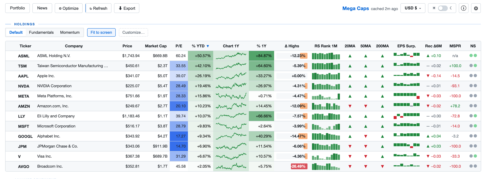
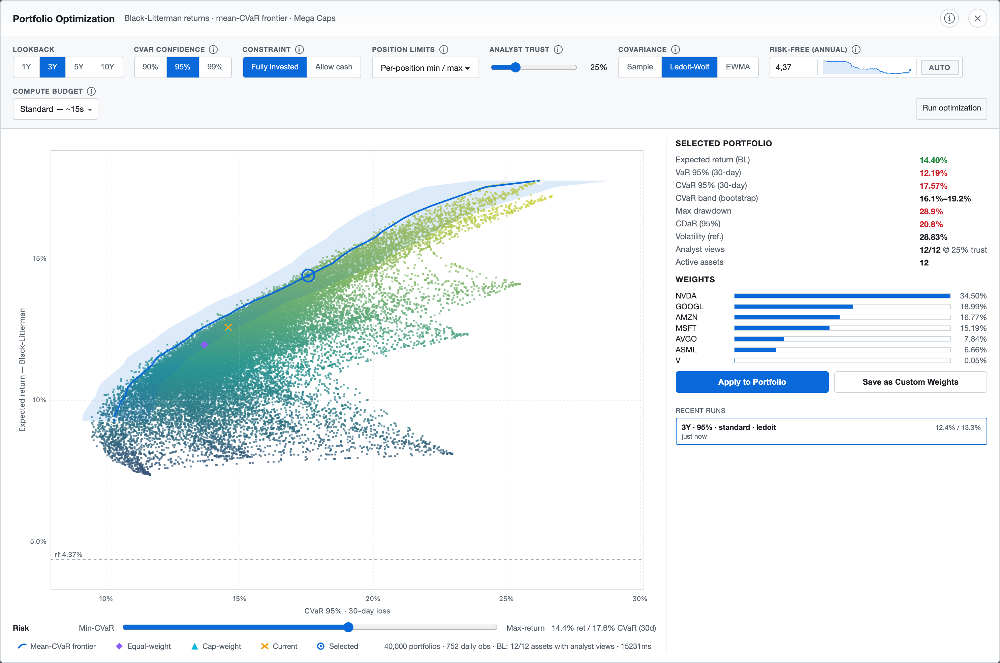
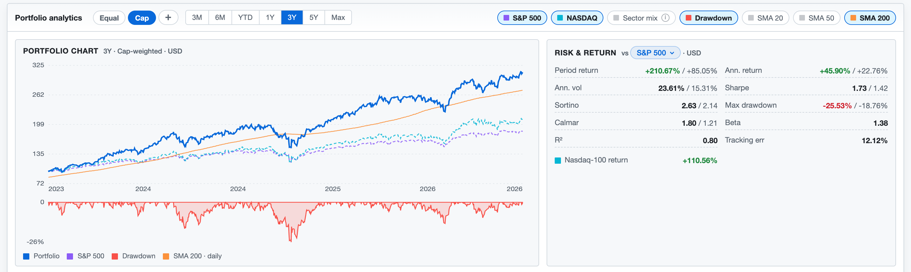
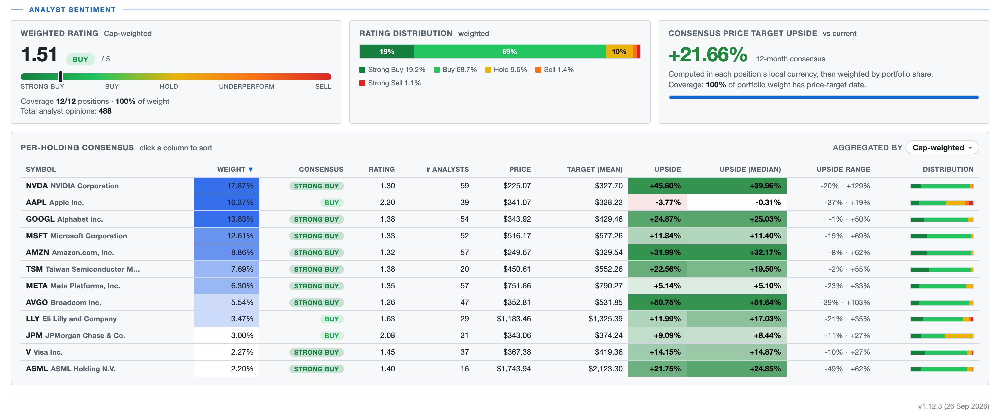
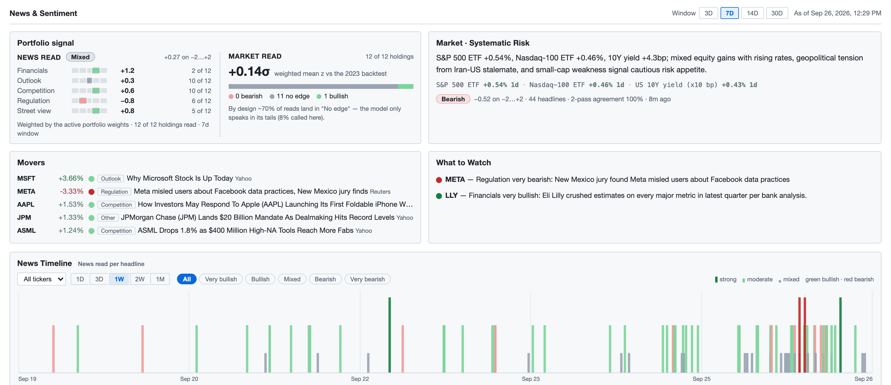

# Convexity

**Convexity** — a portfolio optimization app built for long-term horizon investing. Runs locally: no cloud accounts, no data leaving your machine.

Built on top of [yfinance](https://github.com/ranaroussi/yfinance) and a tiny stdlib HTTP server. Open it in any browser, paste your tickers, and get a live heat-mapped table in seconds.



## A tour

**Portfolio optimization.** Black-Litterman expected returns (market-cap equilibrium blended with analyst price-target views) and a mean-CVaR efficient frontier solved by a custom 8-core interior-point solver. Slide along the frontier, see the tail risk, weights and bootstrap uncertainty band, and apply the result as a weight preset.



**Portfolio analytics.** Performance against the S&P 500 (plus Nasdaq and a sector-mix overlay), moving averages, drawdown, and a risk & return card with Sharpe, Sortino, Calmar, beta and tracking error against any benchmark.



**Analyst sentiment.** Weighted consensus rating, rating distribution, price-target upside (mean and median) and the full range of analyst targets for every holding.



**News & sentiment.** Two independent reads of every holding's headlines: the *News read* (an LLM scoring each headline across financials, outlook, competition, regulation and street view) and the *Market read* (a statistical model of how prices have historically reacted to news like this). Plus movers, what to watch, a market-risk line and a per-headline timeline.



---

## Features

| Column | Description |
|---|---|
| **Price / Market Cap** | Last close price and total market capitalisation |
| **P/S** | Price-to-Sales — heat map anchored at 10× (expensive) |
| **P/E** | Price-to-Earnings — heat map anchored at 40× |
| **% YTD / % 1Y** | Diverging colour scale: green = positive, red = negative |
| **Chart 1Y** | 252-day sparkline, coloured by 1-year return sign |
| **Δ Highs** | Distance from all-time high — bar grows as drawdown deepens |
| **RS Rank 1M** | 12-month relative-strength histogram |
| **20 / 50 / 200 SMA** | Moving-average flags (▲ above, ▼ below) |

**Additional**

- **Streaming progress bar** — rows appear as they load, one at a time
- **Sort** — click any column header or use the ⇅ Sort menu
- **Dark / light mode** — pill toggle, preference saved to `localStorage`
- **Watchlists** — save and reload named portfolios via `localStorage`
- **CSV export** — download the current table as a `.csv`
- **Column guide** — ⓘ button opens a LaTeX-rendered column reference
- **Click-through detail** — click any row for a full-size 1-year chart and stats

---

## Quick start

### Desktop app (recommended)

Runs the same dashboard in a native window (PySide6 + QtWebEngine) instead of
a browser tab — no Chrome dependency, custom dock/window icon, branded splash
screen.

```bash
# macOS / Linux — one-time setup (installs Miniforge if needed, creates the
# `pt` conda env, builds a Convexity.app launcher + Desktop shortcut)
./install.sh

# Windows — same idea, creates Start Menu + Desktop shortcuts
# (written to mirror install.sh; see CLAUDE.md for what's untested)
.\install.ps1
```

After that, launch **Convexity** from Launchpad/Spotlight/Start Menu
or your Desktop shortcut like any other app. To pick up new commits later:

```bash
./update.sh      # macOS/Linux
.\update.ps1      # Windows
```

The browser-mode entry points below (`dashboard.py`, `Launch Dashboard.command`)
keep working exactly as before — the desktop app is purely additive.

### Option A — double-click (macOS)

Double-click **`Launch Dashboard.command`** in Finder.  
It activates your `pt` conda environment (or falls back to system Python), installs any missing dependencies, and opens the browser automatically.

### Option B — terminal

```bash
# create a virtual environment (one-time)
python -m venv .venv && source .venv/bin/activate
pip install -r requirements.txt

# run
python dashboard.py
# → opens http://localhost:8765
```

### Option C — conda

```bash
conda activate pt            # or any env that has yfinance + pandas
python dashboard.py
```

---

## Usage

1. Click **✎ Edit Portfolio** to expand the input box.
2. Paste tickers (or company names) separated by commas or newlines.
3. Press **Build Dashboard** (or `Cmd/Ctrl + Enter`).
4. Rows stream in as data is fetched — a thin progress bar tracks completion.
5. Click **★ Save Watchlist** to persist your tickers for next time.

---

## Requirements

| Package | Minimum version |
|---|---|
| Python | 3.10+ |
| yfinance | 1.0.0+ |
| pandas | 2.0.0+ |
| numpy | 1.24.0+ |
| requests | 2.28.0+ |

---

## Architecture

Everything lives in a single file, `dashboard.py`:

```
dashboard.py
├── fetch_one()         — per-symbol yfinance fetch with retry + backoff
├── fetch_portfolio()   — parallel fetch with 5-worker concurrency cap
├── INDEX_HTML          — self-contained HTML/CSS/JS frontend (no build step)
└── Handler             — stdlib ThreadingHTTPServer
    ├── GET  /          — serves INDEX_HTML
    ├── GET  /api/health
    └── POST /api/quotes-stream   — NDJSON streaming endpoint (rows sent as they arrive)
```

The frontend uses no external JS frameworks — only vanilla JS and KaTeX (loaded from CDN) for the column-guide formulas.

---

## Rate limits

Yahoo Finance is an unofficial API. To avoid 429 errors:

- Concurrency is capped at **5 parallel requests**
- Each symbol retries up to **3 times** with exponential back-off
- yfinance 1.0+ uses `curl_cffi` for TLS fingerprinting; no custom session is passed

---

## License

All rights reserved — the source is published for viewing only. No use, copying,
modification, redistribution or commercial use without written permission.
See [LICENSE](LICENSE).
